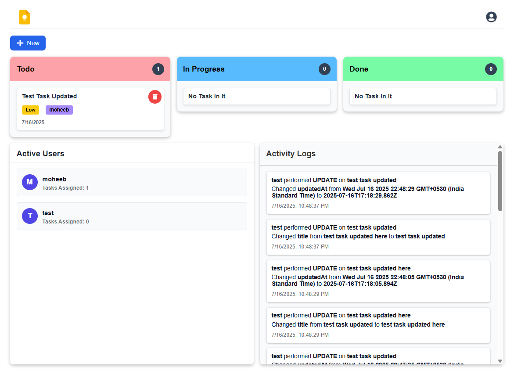

# 📋 Real-Time Collaborative Task Board

A full-featured **real-time task management application** built using the **MERN Stack** with **Socket.IO** for real-time synchronization. It allows users to collaborate on a kanban board with features like smart task assignment, drag & drop, activity logging, and conflict handling.

---

## 🛠️ Tech Stack

* **Frontend:** React, Vite, Redux Toolkit, React Router, React Icons, @hello-pangea/dnd (Drag & Drop)
* **Backend:** Node.js, Express.js
* **Database:** MongoDB with Mongoose
* **Realtime Communication:** Socket.IO

---

## 🚀 Features

* 🧑‍💼 User Authentication (Login, Register, Logout)
* 🔒 Protected Routes
* 📌 Create / Update / Delete Tasks
* 📊 Kanban-style Board (Todo, In Progress, Done)
* 🔄 Drag & Drop Tasks (via `@hello-pangea/dnd`)
* 🧠 Smart Assign: Assign tasks to the user with the least active workload
* 🔁 Real-Time Sync Across All Users (via Socket.IO)
* 📝 Activity Logs for task actions
* ⚔️ Conflict Handling: Handle concurrent task edits

---

## 📦 Project Structure

```
- 📁 client                 # Frontend React Application
  - 📁 src
    - 📁 api/               # API services (task, auth, logs, users)
    - 📁 components/        # Reusable UI Components
    - 📁 pages/             # Page Components (Login, Register, Home, etc)
    - 📁 routes/            # Route Guard (ProtectedRoute)
    - 📁 store/             # Redux slices
    - 📁 utils/             # Socket config
    - 📁 assets/
      - 📁 img/     # Image files
      - 📁 styles/     # Custom CSS files

- 📁 server/                 # Backend Express Application
  - 📁 config/              # DB, Socket config
  - 📁 controllers/         # Request handlers
  - 📁 middlewares/         # Authentication middleware
  - 📁 models/              # Mongoose schemas
  - 📁 routes/              # API route handlers
  - 📁 services/            # Business logic
  - 📄 app.js               # Entry point
```

---

## ⚙️ Installation Instructions

### 1️⃣ Clone the repository

```bash
git clone https://github.com/moheebk123/To-Do-Board.git
cd To-Do-Board
```

### 2️⃣ Setup the Backend

```bash
cd server
npm install

# Setup .env
PORT=3000
MONGODB_URI=your-mongodb-uri
MONGODB_DB_NAME=todo-board
ORIGIN=http://localhost:5173
JWT_SECRET=your-jwt-secret
JWT_REFRESH_SECRET=your-jwt-refresh-secret

npm run dev
```

### 3️⃣ Setup the Frontend

```bash
cd ../client
npm install

# Setup .env
VITE_BACKEND_API_URL=http://localhost:3000

npm run dev
```

The app will be accessible at [http://localhost:5173](http://localhost:5173)

---

## 📖 Usage Guide

* 🏁 Register and Login to your account
* 📌 Create tasks from the board
* 💡 Smart Assign if no user is assigned
* 📦 Drag & drop tasks between columns
* 🔄 Any changes will reflect across other users instantly
* 📝 View activity logs

---

## 💡 Smart Assign Logic

Smart Assign automatically assigns a task to the user who currently has the **least number of active (not done)** tasks:

1. On smart-assign action, the backend fetches all tasks that are not marked as `Done`.
2. It groups these tasks by assigned user and counts them.
3. The user with the lowest count is selected.
4. The task is updated and assigned to that user.
5. A corresponding activity log is created.

---

## ⚔️ Conflict Handling Logic

When a user tries to update a task:

1. The frontend sends the task's `_id` and compares the `updatedAt` timestamp with the database version.
2. **If the timestamps don't match**, a conflict is detected.
3. The backend responds with the existing task version.
4. The frontend displays both versions:

   * ✏️ Your version (what user tried to update)
   * 📄 Current version (already updated by someone else)
5. User can:

   * **Merge** changes
   * **Overwrite** the task completely

**Example:**

* User A and User B open Task X at the same time.
* User A updates title to "Fix login bug".
* User B updates priority to "High".
* If A submits after B, the system shows a conflict so both changes can be merged manually.

---

## 🔗 Live Demo

🔴 **Live App:** [https://to-do-board-one.vercel.app](https://to-do-board-one.vercel.app)

---

## 📹 Video Demo

🔴 **Demo Video:** [Watch here](./project-documents/ToDo_Board_Demo.mp4)

---

## ✨ Screenshot

🔴 **App Screenshot** 

---

## ⚠️ Note About Live Deployment (Render)

Due to how **Render** handles backend deployment (cold starts), the server may take a few seconds to wake up after inactivity.
As a result, if you try to perform any task action (like create/update/delete) immediately after opening the site, you might see an **error message**.

🔁 Just **refresh the page once**, and everything will work correctly afterward.

🟢 **On local development** or when deployed to a **persistent backend service** (like Vercel Functions with Edge Config, Railway, or a VPS), this issue **does not occur**, and all actions work seamlessly without delay.

✅ Once the backend is active, real-time sync and task actions work as expected.

---

## 🙋 Author

Developed with 💙 by [Moheeb Khan](https://github.com/moheebk123)

---

> For any queries or issues, feel free to raise an issue or contact via GitHub.
